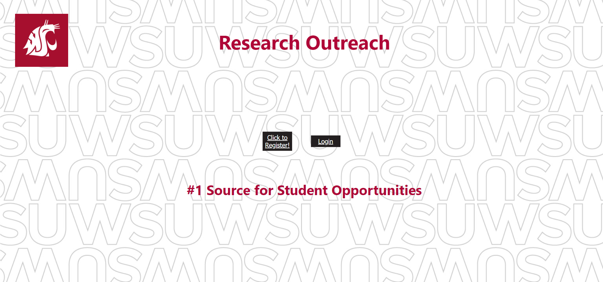

# WSU Student and Faculty Research Website

Created by Dylan Tarlyn, Bobby Templin, Wenda Liu, and Keagen Brendle for Computer Science 322 - Software Engineering in the Fall of 2021.

Used: Python, CSS, HTML, mySQL, and Flask for database creation and management. 

Website allows users to create a profile as either a student or a faculty. Faculty can create research positions, and can manage students who apply to their positions. Students can only view and apply to research positions.

Requirements are listed in requirements.txt.

To launch, run 'python research.py' then open localhost in browser. New database should be created for launched website.

# Greeting Screen

# Registration Page

# Student's View of Homepage

# Only Students can Apply to Positions

# Faculty Application Management

